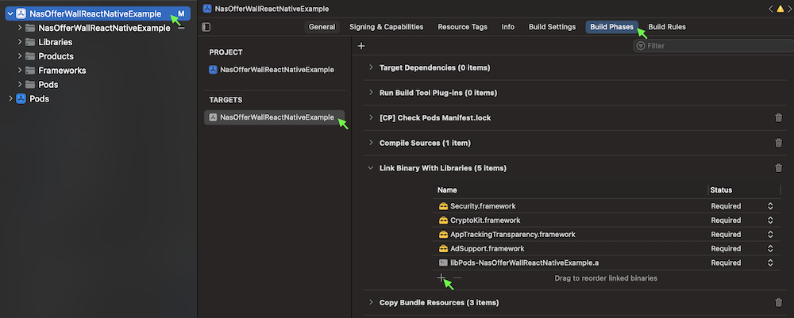
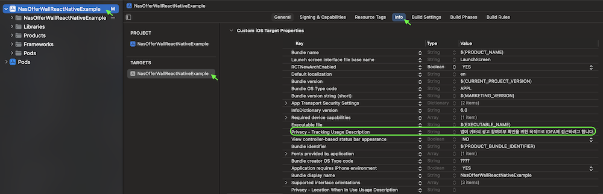

# 📖 NAS 오퍼월 React Native SDK - 내장 UI 개발 가이드
이 문서는 NAS 오퍼월 SDK 내장 UI 연동 가이드를 제공합니다.

오퍼월 UI 표시 방식은 다음 두가지를 지원합니다.

- `내장 UI` : 미리 만들어진 UI를 사용하는 방식으로, 별도의 UI 개발 없이 쉽게 연동할 수 있습니다.
- `개발자 정의 UI` : 개발자가 UI를 직접 만들어서 연동할 수 있는 방식으로, 개발자 앱의 UI에 맞게 자유롭게 구성할 수 있습니다.

`개발자 정의 UI`를 사용 하려면, [📖 개발자 정의 UI 개발 가이드](Guide.Custom.md) 문서를 참고해 주시기 랍니다.

## 목차
- [📝⠀업데이트](#-업데이트)
- [👤 개발자/매체 등록](#-개발자매체-등록)
- [💾 설치하기](#-설치하기)
  - [SDK 설치](#-SDK-설치)
  - [iOS 추가 설정](#-iOS-추가-설정)
    - [CocoaPods 설치](#--CocoaPods-설치)
    - [라이브러리 추가](#--라이브러리-추가)
    - [추적 권한 허용 표시 문구 설정](#--추적-권한-허용-표시-문구-설정)
    - [Privacy Manifest 설정](#--Privacy-Manifest-설정)
  - [Android 추가 설정](#-Android-추가-설정)
    - [Maven Repository 추가](#--Maven-Repository-추가)
- [🚀 초기화](#-초기화)
  - [개발자 서버에서 적립금 관리 시](#-개발자-서버에서-적립금-관리-시)
  - [NAS 서버에서 적립금 관리 시](#-NAS-서버에서-적립금-관리-시)
- [📱 오퍼월 표시](#-오퍼월-표시)
  - [팝업 오퍼월](#-팝업-오퍼월)
- [💰 적립금](#-적립금)
  - [획득 가능 총 적립금 조회](#-획득-가능-총-적립금-조회)
  - [보유 적립금 조회](#-보유-적립금-조회-NAS-서버에서-적립금-관리-시-사용) *(NAS 서버에서 적립금 관리 시 사용)*
  - [아이템 목록 조회](#-아이템-목록-조회-NAS-서버에서-적립금-관리-시-사용) *(NAS 서버에서 적립금 관리 시 사용)*
  - [아이템 구입](#-아이템-구입-NAS-서버에서-적립금-관리-시-사용) *(NAS 서버에서 적립금 관리 시 사용)*
- [📦 기타](#-기타)
  - [테마 설정](#-테마-설정)
- [📘⠀정의](#-정의)
  - [NasWallError](#-NasWallError)
  - [NasWallPointInfo](#-NasWallPointInfo)
  - [NasWallItemList](#-NasWallItemList)
  - [NasWallItemInfo](#-NasWallItemInfo)
  - [NasWallTheme](#-NasWallTheme)
- [📖⠀다른 문서](#-다른-문서)
- [🔗⠀다른 플렛폼 SDK](#-다른-플렛폼-sdk)

## 📝 업데이트
- `v1.0.2`
  - 초기화 함수(개발자 서버에서 적립금 관리) 호출 시 앱이 종료되는 버그가 수정되었습니다.

- `v1.0.1`
  - 버그가 수정되었습니다.

- `v1.0.0`
  - 최초 배포


- [전체 업데이트 목록 보기](Update.md)

## 👤 개발자/매체 등록
[오퍼월 적용 가이드 문서](https://github.com/mafin-global/nas-offerwall#%EF%B8%8F-%EA%B0%9C%EB%B0%9C%EC%9E%90-%EB%93%B1%EB%A1%9D) 를 참고해주세요.

## 💾 설치하기

### 🔹 SDK 설치

`npm` 또는 `yarn`을 사용하여 SDK를 설치합니다.

```bash
# npm 사용 시
npm install nas-offerwall-sdk-react-native

# yarn 사용 시
yarn add nas-offerwall-sdk-react-native
```

### 🔹 iOS 추가 설정

#### - *CocoaPods 설치*
`/ios` 폴더에서 다음을 실행합니다.

```bash
pod install
```

#### - *라이브러리 추가*
`프로젝트 설정` > `Build Phases` > `Link Binary With Libraries` 에서 다음 라이브러리를 추가합니다.

- AppTrackingTransparency.framework
- AdSupport.framework
- CryptoKit.framework
- Security.framework



#### - *추적 권한 허용 표시 문구 설정*

`Info.plist`에 `Privacy - Tracking Usage Description` 키를 추가한 후, 추적 권한 허용을 위한 표시 문구를 입력합니다. 문구는 앱의 성격에 맞게 변경할 수 있습니다.

- 추천 문구 : `앱이 귀하의 광고 참여여부 확인을 위한 목적으로 IDFA에 접근하려고 합니다.`



#### - *Privacy Manifest 설정*

[/sdk](/sdk) 폴더에 있는 [PrivacyInfo.xcprivacy](/sdk/PrivacyInfo.xcprivacy) 파일에 SDK가 사용하는 Privacy Manifest 정보가 포함되어 있습니다.

귀사의 `PrivacyInfo.xcprivacy` 파일에 내용을 추가하거나, [/sdk](/sdk) 폴더에 있는 파일을 사용하시기 바랍니다.

`Privacy Manifest` 관련 자세한 내용은 [애플 공식 문서](https://developer.apple.com/documentation/bundleresources/privacy_manifest_files)를 확인해 주시기를 바랍니다.

### 🔹 Android 추가 설정

#### - *Maven Repository 추가*
`/android/build.gradle` 파일에 Maven Repository를 추가합니다.

파일 내에 `allprojects` 블록의 `repositories` 에 `maven { url "https://ow.appang.kr/repository" }` 항목을 추가합니다.

만약, `allprojects` 블록이 없다면, 아래의 전체 내용을 추가합니다.

```groovy
...

allprojects {
    repositories {
        google()
        mavenCentral()

        // 추가
        maven { url "https://ow.appang.kr/repository" }
    }
}

...
```

## 🚀 초기화
SDK를 초기화합니다.

*❗ SDK의 다른 모든 함수를 호출하기 전에 초기화 함수를 가장 먼저 호출해야합니다.*   
*❗ 앱 내에서 회원이 로그아웃 후 다른 계정으로 로그인하는 경우, 새로 로그인한 회원 정보를 기준으로 다시 초기화 함수를 호출해야합니다.*

### 🔹 *개발자 서버에서 적립금 관리 시*

```typescript
function initializeDeveloperServer(
  appKey: string,
  userData: string,
  testMode: boolean
): Promise<void>
```

- Parameters
  - `appKey`: 앱의 32자리 고유 키를 지정합니다. NAS 개발자 홈페이지의 "매체 관리" 메뉴에서 확인할 수 있습니다.
  - `userData`: 회원 ID 등의 적립금 지급에 필요한 고유한 회원 정보를 지정합니다. 광고 참여 완료 시 개발자 서버로 콜백 호출될 때 함께 제공됩니다.
  - `testMode`: `true` 로 설정 시 테스트 광고가 표시됩니다.


- Result
  - `Promise<void>`
    - `성공(then)`: 초기화 성공 시 호출됩니다.
    - `실패(catch)`: 초기화 실패 시 오류([NasWallError](#-NasWallError)) 정보가 제공됩니다.

*사용 예시*
```javascript
import NasWall from 'nas-offerwall-sdk-react-native';

NasWall.initializeDeveloperServer(appKey, userData, testMode).then(() => {
    // 초기화 성공 시 처리 코드
}).catch((error) => {
    // 초기화 실패 시 처리 코드
});
```

### 🔹 *NAS 서버에서 적립금 관리 시*
```typescript
function initializeNasServer(
  appKey: string,
  userId: string,
  testMode: boolean
): Promise<void>
```

- Parameters
  - `appKey`: 앱의 32자리 고유 키를 지정합니다. NAS 개발자 홈페이지의 "매체 관리" 메뉴에서 확인할 수 있습니다.
  - `userId`: 회원의 고유한 ID를 지정합니다. "적립금 조회", "아이템 구입" 시 여기서 지정한 회원 ID를 기준으로 적용됩니다.
  - `testMode`: `true` 로 설정 시 테스트 광고가 표시됩니다.


- Result
  - `Promise<void>`
    - `성공(then)`: 초기화 성공 시 호출됩니다.
    - `실패(catch)`: 초기화 실패 시 오류([NasWallError](#-NasWallError)) 정보가 제공됩니다.

*사용 예시*
```javascript
import NasWall from 'nas-offerwall-sdk-react-native';

NasWall.initializeDeveloperServer(appKey, userId, testMode).then(() => {
  // 초기화 성공 시 처리 코드
}).catch((error) => {
  // 초기화 실패 시 처리 코드
});
```

## 📱 오퍼월 표시
오퍼월의 표시 색상 및 스타일은 NAS 개발자 홈페이지의 "매체 관리" 메뉴에서 변경할 수 있습니다.

### 🔹 *팝업 오퍼월*
팝업 오퍼월(전체 화면)을 표시합니다.

```typescript
function openPopupOfferWall(
  onClose?: () => void
): Promise<void>
```

- Parameters
  - `onClose`(Optional): 오퍼월이 종료된 후 호출되는 핸들러입니다.


- Result
  - `Promise<void>`
    - `성공(then)`: 오퍼월 표시 성공 시 호출됩니다.
    - `실패(catch)`: 오퍼월 표시 실패 시 오류([NasWallError](#-NasWallError)) 정보가 제공됩니다.

*사용 예시*
```javascript
import NasWall from 'nas-offerwall-sdk-react-native';

function handleOfferWallClose() {
  // 오퍼월이 종료된 후 처리 코드
}

NasWall.openPopupOfferWall(handleOfferWallClose).then(() => {
  // 오퍼월 열기 성공 시 처리 코드
}).catch((error) => {
  // 오퍼월 열기 실패 시 처리 코드
});
```

## 💰 적립금

### 🔹 *획득 가능 총 적립금 조회*
획득 가능한 총 적립금을 조회합니다.

```typescript
function totalPoint(): Promise<NasWallPointInfo>
```

- Result
  - `Promise<NasWallPointInfo>`
    - `성공(then)`: 조회 성공 시 적립금([NasWallPointInfo](#-NasWallPointInfo)) 정보가 제공됩니다.
    - `실패(catch)`: 조회 실패 시 오류([NasWallError](#-NasWallError)) 정보가 제공됩니다.

*사용 예시*
```javascript
import NasWall from 'nas-offerwall-sdk-react-native';

NasWall.totalPoint().then((pointInfo) => {
  // 조회 성공 시 처리 코드
}).catch((error) => {
  // 조회 실패 시 처리 코드
});
```

### 🔹 *보유 적립금 조회 (NAS 서버에서 적립금 관리 시 사용)*
NAS 서버에서 적립금을 관리하는 경우, 회원이 보유한 적립금을 조회합니다.

"적립금 관리 서버"가 "NAS 서버 사용"으로 설정된 경우에만 사용합니다.  "적립금 관리 서버" 설정은 NAS 개발자 홈페이지의 "매체 관리" 메뉴에서 설정을 통해 확인 및 변경할 수 있습니다.

*❗ [초기화](#-초기화) 함수를 통해 지정한 `userId(회원 ID)` 를 기준으로 조회됩니다.*

```typescript
function userPoint(): Promise<NasWallPointInfo>
```

- Result
  - `Promise<NasWallPointInfo>`
    - `성공(then)`: 조회 성공 시 적립금([NasWallPointInfo](#-NasWallPointInfo)) 정보가 제공됩니다.
    - `실패(catch)`: 조회 실패 시 오류([NasWallError](#-NasWallError)) 정보가 제공됩니다.

*사용 예시*
```javascript
import NasWall from 'nas-offerwall-sdk-react-native';

NasWall.userPoint().then((pointInfo) => {
  // 조회 성공 시 처리 코드
}).catch((error) => {
  // 조회 실패 시 처리 코드
})
```

### 🔹 *아이템 목록 조회 (NAS 서버에서 적립금 관리 시 사용)*
NAS 서버에서 적립금을 관리하는 경우, 구입 가능한 아이템 목록을 조회합니다.

"적립금 관리 서버"가 "NAS 서버 사용"으로 설정된 경우에만 사용합니다.  "적립금 관리 서버" 설정은 NAS 개발자 홈페이지의 "매체 관리" 메뉴에서 설정을 통해 확인 및 변경할 수 있습니다.

```typescript
function itemList(): Promise<NasWallItemList>
```

- Result
  - `Promise<NasWallItemList>`
    - `성공(then)`: 조회 성공 시 아이템 목록([NasWallItemList](#-NasWallItemList)) 정보가 제공됩니다.
    - `실패(catch)`: 조회 실패 시 오류([NasWallError](#-NasWallError)) 정보가 제공됩니다.

*사용 예시*
```javascript
import NasWall from 'nas-offerwall-sdk-react-native';

NasWall.itemList().then((itemList) => {
  // 조회 성공 시 처리 코드
}).catch((error) => {
  // 조회 실패 시 처리 코드
});
```

### 🔹 *아이템 구입 (NAS 서버에서 적립금 관리 시 사용)*
NAS 서버에서 적립금을 관리하는 경우, 보유 적립금을 이용하여 아이템을 구입합니다.

"적립금 관리 서버"가 "NAS 서버 사용"으로 설정된 경우에만 사용합니다.  "적립금 관리 서버" 설정은 NAS 개발자 홈페이지의 "매체 관리" 메뉴에서 설정을 통해 확인 및 변경할 수 있습니다.

*❗ [초기화](#-초기화) 함수를 통해 지정한 `userId(회원 ID)` 를 기준으로 구입됩니다.*

```typescript
function purchaseItem(itemId: number, qty: number): Promise<NasWallPointInfo>
```
- 
- Parameters
  - `itemId`: 구입 할 아이템 ID를 지정합니다. NAS 개발자 홈페이지의 "매체 관리" 메뉴에서 아이템을 등록하면, 아이템 ID를 확인할 수 있습니다.
  - `qty`: 구입 수량을 지정합니다.


- Result
  - `Promise<NasWallPointInfo>`
    - `성공(then)`: 구입 성공 시 구입 금액을 차감한 잔여 적립금([NasWallPointInfo](#-NasWallPointInfo)) 정보가 제공됩니다.
    - `실패(catch)`: 구입 실패 시 오류([NasWallError](#-NasWallError)) 정보가 제공됩니다.

*사용 예시*
```javascript
import NasWall from 'nas-offerwall-sdk-react-native';

NasWall.purchaseItem(itemId, qty).then(() => {
  // 아이템 구입 성공 시 처리 코드
}).catch((error) => {
  // 아이템 구입 실패 시 처리 코드
});
```

## 📦 기타

### 🔹 *테마 설정*
테마(라이트/다크 모드)를 설정합니다. 팝업, 임베드 오퍼월 표시될 때, 설정한 테마를 기준으로 배경색이 표시됩니다.

```typescript
function setTheme(theme: NasWallTheme): void
```

- Parameters
  - `theme`: 테마를 지정합니다.
    - `NasWallTheme.light`: 라이트 테마
    - `NasWallTheme.dark`: 다크 테마

*사용 예시*
```javascript
import NasWall from 'nas-offerwall-sdk-react-native';

// 라이트 테마
NasWall.setTheme(NasWallTheme.light);

// 다크 테마
NasWall.setTheme(NasWallTheme.dark);
```

## 📘 정의

### 🔹 *NasWallError*
오류 정보
```typescript
interface NasWallError {
  code: string;     // 오류 코드
  message: string;  // 오류 메시지
}
```

### 🔹 *NasWallPointInfo*
적립금 정보
```typescript
interface NasWallPointInfo {
  point: number;        // 적립금
  unit: string;         // 적립금 단위
  stringValue: string;  // "(적립금)(단위)" 예)"35,270원"
}
```

### 🔹 *NasWallItemList*
아이템 목록
```typescript
type NasWallItemList = NasWallItemInfo[];
```

### 🔹 *NasWallItemInfo*
아이템 정보
```typescript
interface NasWallItemInfo {
  id: number;     // 아이템 ID
  name: string;   // 아이템 이름
  price: number;  // 아이템 가격
  unit: string;   // 가격 단위
}
```

### 🔹 *NasWallTheme*
테마
```typescript
type NasWallTheme = 'light' | 'dark';

const NasWallTheme = {
  light: 'light', // 라이트 테마
  dark: 'dark',   // 다크 테마
} as const;
```

## 📖 다른 문서
- [개발자 정의 UI 개발 가이드](Guide.Custom.md) : 개발자가 UI를 직접 만들어서 연동할 수 있는 방식으로, 개발자 앱의 UI에 맞게 자유롭게 구성할 수 있습니다.

## 🔗 다른 플렛폼 SDK
- [Android SDK](https://github.com/mafin-global/nas-offerwall-android)
- [iOS SDK](https://github.com/mafin-global/nas-offerwall-ios)
- [Unity SDK](https://github.com/mafin-global/nas-offerwall-unity)
